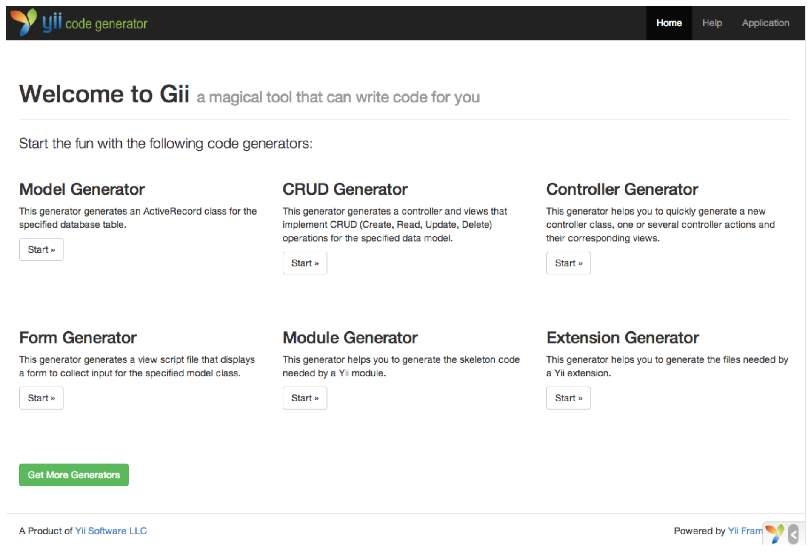
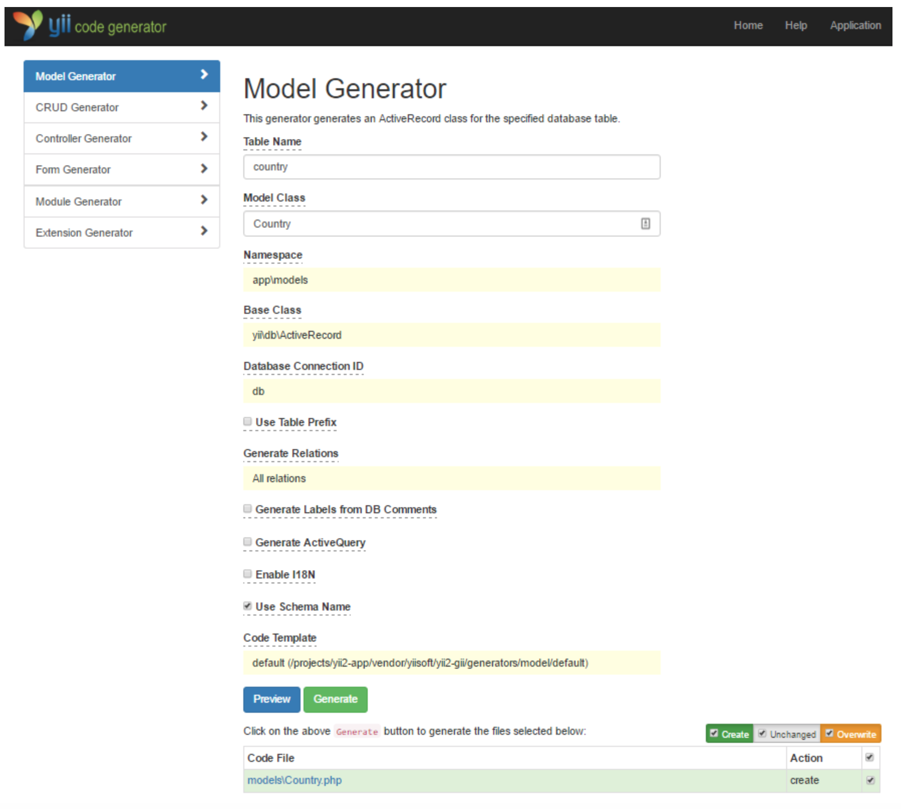
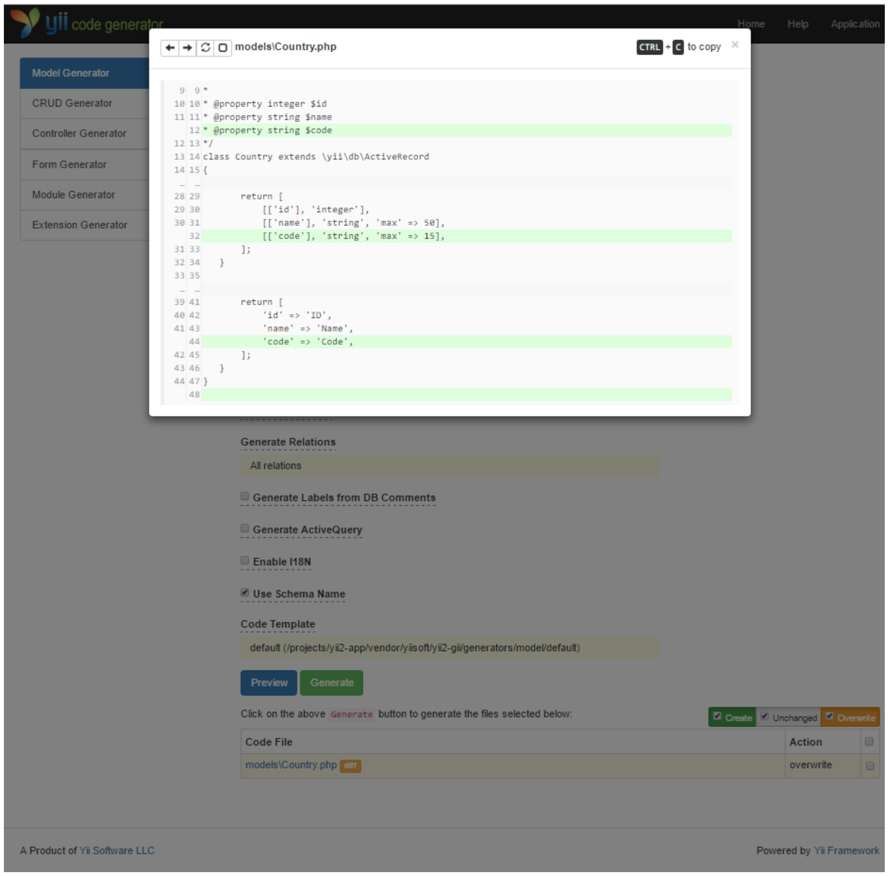
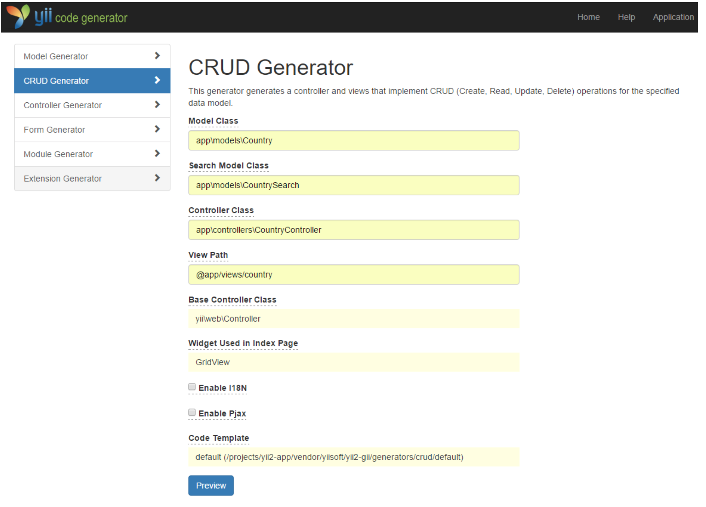
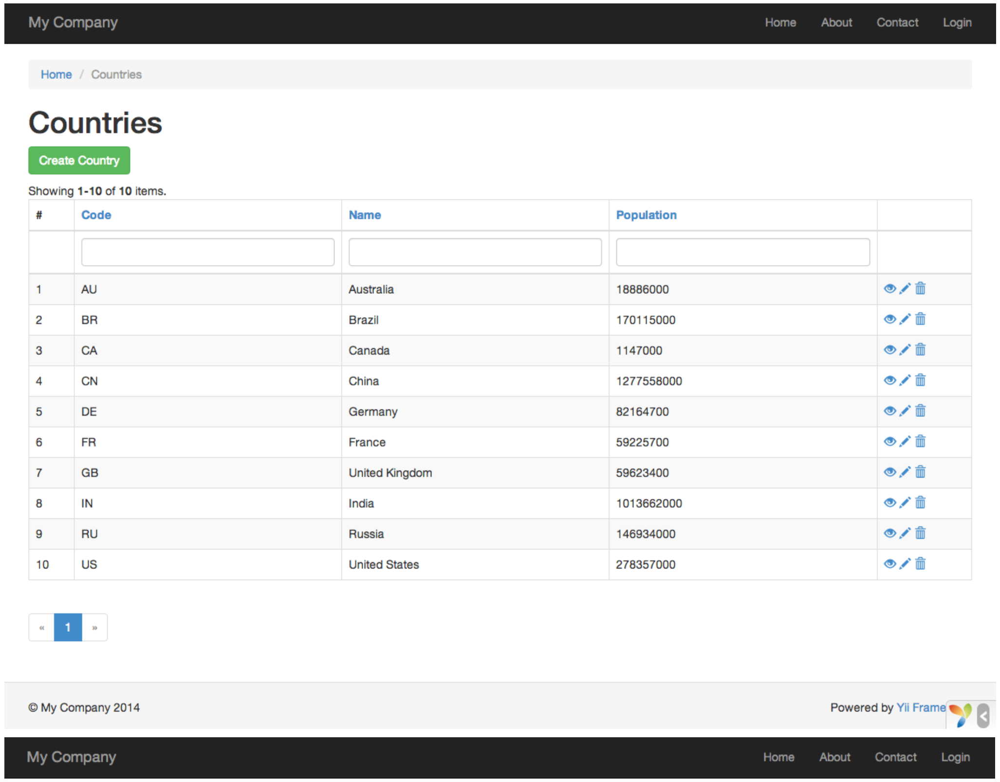
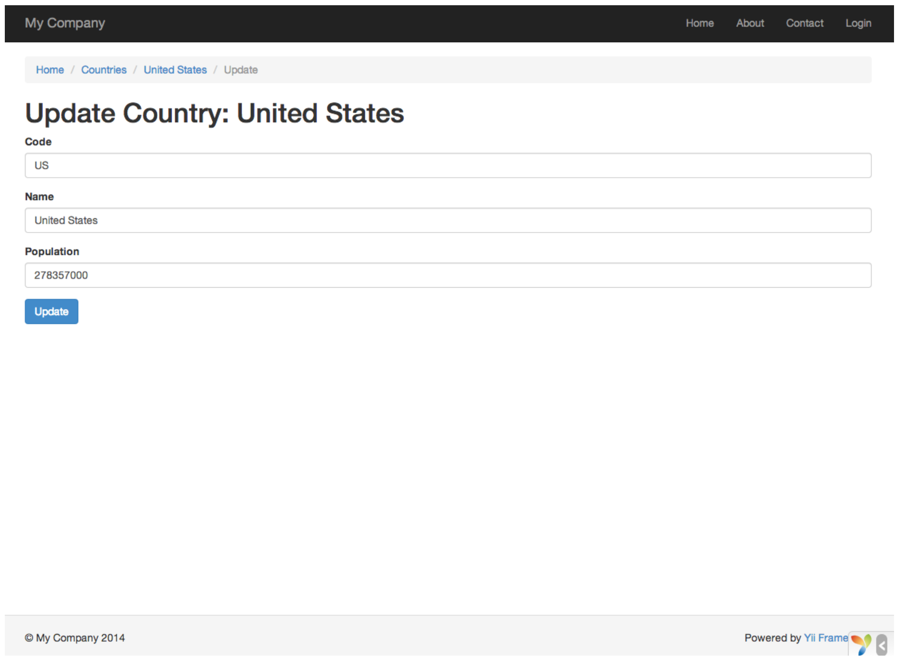

#Generare codice con Gii

Questa sezione descrive come utilizzare " Gii " per generare automaticamente il codice che implementa alcune funzioni comuni del sito Web. Utilizzare Gii per generare codice in automatico è semplicemente una questione di immissione delle informazioni giuste per le istruzioni visualizzate nelle pagine Web Gii.
Attraverso questo tutorial, imparerai come:
- abilitare Gii nella tua applicazione,
- utilizzare Gii per generare una classe Active Record,
- utilizzare Gii per generare il codice che implementa le operazioni CRUD per una tabella DB,
- personalizzare il codice generato da Gii.

##Partiamo da Gii

Gii viene fornito da Yii come modulo. E' possibile abilitare Gii configurandolo nella proprietà dei moduli nell'applicazione. A seconda del modo in cui è stata creata l'applicazione, è possibile che il codice riportato di seguito sia già fornito nel file di configurazione ```config/web.php```.

    $config = [ ... ];

    if (YII_ENV_DEV) {
        $config['bootstrap'][] = 'gii';
        $config['modules']['gii'] = [
            'class' => 'yii\gii\Module',
        ];
    }

La configurazione soprastante indica che l'applicazione deve includere un modulo denominato ```gii```, che fa parte della classe " yii \ gii \ Module ".
Se selezioniamo l'entry script della nostra applicazione ( ```web/index.php```), troverete la seguente riga, il che rende essenzialmente ```YII_ENV_DEV``` a ```true```

    defined('YII_ENV') or define('YII_ENV', 'dev');

Grazie a questa linea di codica, la nostra applicazione è in modalità di sviluppo e sarà già abilitata a Gii per la configurazione precedentemente impostata da noi. Adesso è possibile accedere a Gii attraverso il seguente URL

    http://hostname/index.php?r=gii

!!!Warning
    Se accediamo a Gii da una macchina diversa da localhsot, l'accesso verrà negato come impostazione predefinita per scopi di protezione. E' possibile configurare Gii per aggiungere gli indirizzi IP consentiti, come segue:

    
        'gii' => [
            'class' => 'yii\gii\Module',
            'allowedIPs' => ['127.0.0.1', '::1', '192.168.0.*', '192.168.178.20'] // adjust this to your needs
        ],




##Generare una classe Active Record


Per utilizzare Gii nella generazione di una classe Active Record, dovete selezionare "Model Generator" (facendo click sul pulsante "Start"). Quindi compilare il modulo come segue:

- Nome della tabella: ```country```
- Classe del modello: ```Country```



Premendo il pulsante "Preview" vedrete il file ```models/Country.php``` che verrà creato dall'Active Record. Puoi anche cliccare sul nome del file per visualizzare l'anteprima del suo contenuto.
Quando si utilizza Gii, se si è già creato lo stesso file, lo sovrascriverà, premendo il pulsante ```diff``` accanto al nome del file per vedere le differenze tra il codice che verrà generato e la versione esistente.



Quando sovrascriverete un file esistente, selezionate la casella accanto a "overwrite" e quindi fate clic sul pulsante "Generate". Se invece si crea un nuovo file, è sufficiente fare clic sul pulsante "Generate".
Successivamente, verrà visualizzata una pagina di conferma, per essere sicuri che il codice sia stato generato in modo corretto o meno. Se si avesse un file esistente, verrà visualizzato anche un messaggio dove verrà indicato che è stato sovrascritto il codice appena generato.

##Generazione codice di un CRUD


CRUD sta per "Create - Read - Update - Delete". Rappresentano le 4 attività comuni che si effettuano sui dati nella maggior parte dei siti Web. Per creare funzionalità CRUD usando Gii, dobbiamo selezione l'opzione "CRUD Generator" (nella pagina indice di Gii). Continuando con l'esempio dei "paesi", compilare il modulo come segue:
- Model Class: ```app\models\Country```
- Search Model Class: ```app\models\CountrySearch```
- Controller Class: ```app\controllers\CountryController```



Premendo il pulsante "preview", verrà visualizzato un elenco di file da generare, come mostrato di seguito:


Se in precedenza avete creato i file ```controllers/CountryController.php``` e ```views/country/index.php``` nella sezione 'Lavorare con i database', controllare la casella "overwrite" per sostituirli.

Per vedere se tutto quello che abbiamo fatto funziona, copiamo il seguente URL nel nostro browser

    http://hostname/index.php?r=country%2Findex

A questo punto vedrai una griglia di dati che mostra i paesi inseriti in precedenza nel nostro database. Puoi ordinare la griglia, oppure filtrarla immettendo le condizioni di filtro nelle intestazioni di colonna.
Per ogni paese visualizzato nella griglia, è possibile scegliere di visualizzarli, modificarli o elimiarli. Puoi anche scegliere di aggiungere un nuovo paese sul pulsante "Create Country" nella parte superiore della griglia.



Schermata relativa alla modifica di un paese:



Di seguito è riportato l'elenco dei file generati da Gii, nel caso in cui si desidera esaminare, implementare (o personalizzare) le funzionalità:
- Controller: ```controllers/CountryController.php```
- Models: ```models/Country.php``` e ```models/CountrySearch.php```
- Views: ```views/country/*.php```

!!!Tip
    Gii è stato progettato per essere uno strumento di generazione di codici estremamente personalizzabile e estensibile. Se utilizziamo Gii accelleriamo notevolmente la velocità nello sviluppo delle applicazioni.