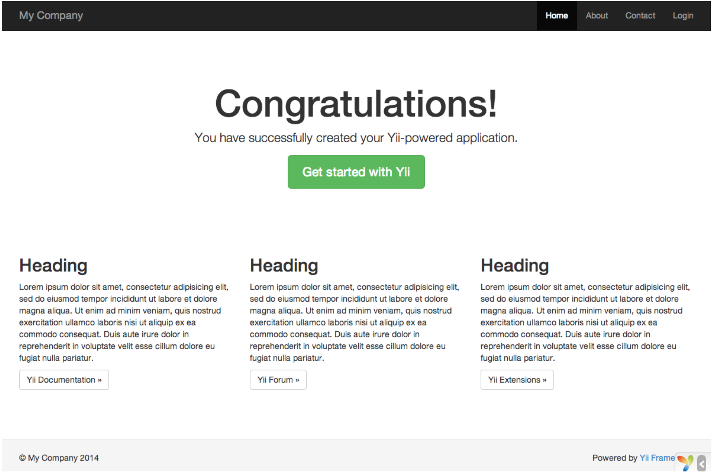

# Installazione di Yii

E’ possibile installare Yii in due modi. Installarlo tramite Composer oppure installarlo da un file di archivio. Il primo è il metodo migliore, in quanto consente di installare nuove estensioni oppure di aggiornare Yii in modo semplice.
In questa e nelle prossime sezioni descriveremo come installare Yii e di come implementare tutte le sue funzionalità e i suoi utilizzi. Esistono due versioni di Yii: la versione base (basic) e la versione avanzata(advanced). La basic è diversa dall’advanced principalmente per l’organizzazione del codice. Nel primo avremo una struttura MVC, mentre nell’advanced avremmo due strutture MVC separate. La parte “backend” e la parte “frontend”.

Info: Il modello della versione basic è adatto allo sviluppo del 90% delle applicazioni Web. Se sei nuovo a Yii, ti consigliamo di attenersi al modello della versione basic per la sua semplicità e le sue funzionalità.

##Installazione tramite Composer

Se è la prima volta che installi il Composer, puoi seguire le istruzioni di <https://getcomposer.org/download/> . Su Linux e Max OS X, eseguire i seguenti comandi:

    curl -sS https://getcomposer.org/installer | php 
    mv composer.phar /usr/local/bin/composer

In questa guida tutti i comandi del compositore presuppongono di aver installato il compositore a livello globale in modo che sia disponibile come comando```composer```. 

Se hai già installato Composer, assicuratevi di utilizzare una versione aggiornata. E' possibile aggiornare il proprio Composer con il comando ```composer self-update```.

##Installazione di Yii

Con Composer installato, è possibile installare Yii eseguendo i seguenti comandi in una cartella accessibile a Web.

    composer global require "fxp/composer-asset-plugin:^1.3.1"
    composer create-project --prefer-dist yiisoft/yii2-app-basic basic

Il primo comando installa il plugin asset del Composer che consente di gestire le dipendenze del pacchetto. Basta eseguirlo solo una volta. Il secondo comando installa l'ultima versione stabile di Yii in una directory denominata ```basic```. Se si desidera è possibile scegliere un nome diverso per la directory di destinazione.

!!!Note
    Se si desidera installare l'ultima versione di sviluppo di Yii, è possibile utilizzare il seguente comando che permette di aggiungere un'opzione di stabilità

        composer create-project --prefer-dist --stability=dev yiisoft/yii2-app-basic basic


##Installazione da un file di archivio

L'installazione di Yii da un file di archivio prevede 3 passaggi:
1. Scaricare il file dall'archivio di http://www.yiiframework.com/download/.
2. Scompattare il file scaricato in una cartella accessibile a web.
3. Modificare il file ```config/web.php``` immettendo una chiave segreta per la ```cookieValidationKey``` (voce di configurazione). Questo avviene automaticamente se si installa Yii con Composer).

    // !!! insert a secret key in the following (if it is empty) - this is required 
           by cookie validation

    'cookieValidationKey' => 'enter your secret key here',

##Verifica dell'installazione

Una volta completata l'installazione, configurare il server Web (vedere le sezione successiva)  oppure utilizzare il server Web incorporato PHP eseguendo il seguente comando della console nella ```web``` directory del progetto

    php yii serve

- Nota: per impostazione predefinita, il server HTTP ascolterà la porta 8080. Tuttavia, se la porta è già in uso o si desidera utilizzare più applicazioni in questo modo, è possibile specificare quale porta deve essere utilizzata. Basta aggiungere l'argomento -port

    php yii serve --port=8888

E' possibile usare il browser per accedere all'applicazione Yii installata con il seguente URL:

    http://localhost:8080/


     

Dovresti avere una schermata uguale a quella sopra. Se ciò non si vede, controlla se l'installazione PHP soddisfa i requisiti di Yii. E' possibile verificare se i requisiti minimi sono soddisfatti utilizzando uno dei sequenti approcci:
- Copia ```\requirements.php``` di ```/web/requirements.php``` e quindi utilizzare un browser per accedervi attraverso il seguene link ```http://localhost/requirements.php```
- Eseguire i seguenti comandi
    cd basic
    php requirements.php

E' necessario configurare l'installazione PHP in modo da soddisfare i requisiti minimi di Yii.

##Configurazione del server Web

!!!Note
    E' possibile saltare questa sezione per ora se si sta seguendo la guida di Yii senza alcuna intenzione di distribuirla a un server di produzione.

Su un server di produzione, è possibile configurare il server Web in modo che l'applicazione sia accessibile tramite l'URL ```http://www.example.com/index.php``` anzichè ```http://www.example.com/basic/web/index.php```. Tale configurazione richiede di indicare la radice del documento del server Web nella cartella```basic/web```.
Si potrebbe anche desiderare di nascondere nell'URL ```index.php```.
