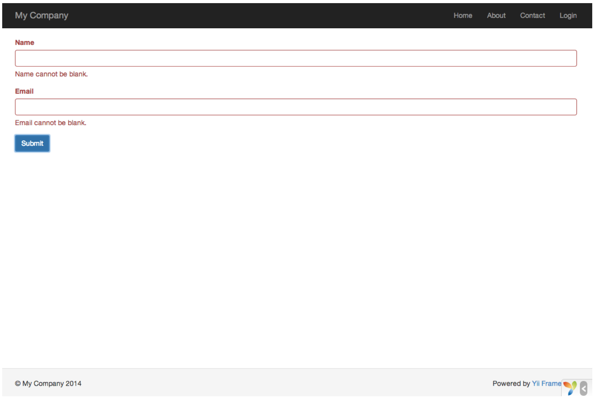
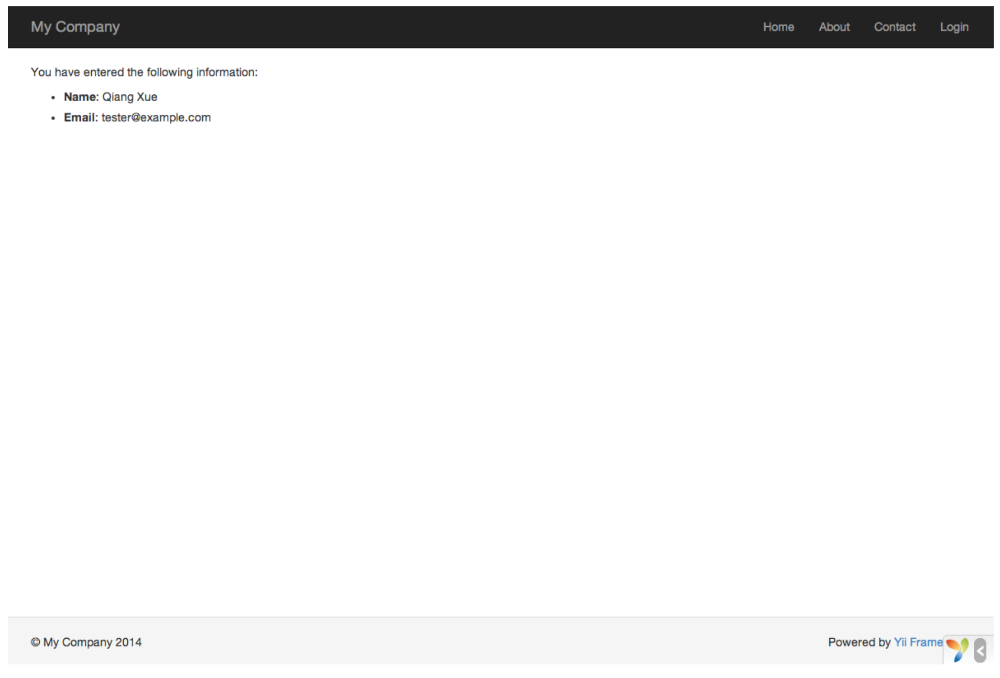

#Lavorare con i moduli


Questa sezione descrive come creare una nuova pagina con un modulo, per ottenere dati/informazioni dall'utente. La pagina visualizzerà una maschera con due campi di immmissione. Un campo per il nome e l'altra per l'e-mail. Dopo aver ricevuto i due valori dall'utente, la pagina ristamperà i valori inseriti per conferma.

Attraverso questo tutorial imparerai come:

- creare un modello per rappresentare i dati inseriti da un utente attraverso un modulo.
- dichiarare regole per convalidare i dati inseriti.
- costruire un modulo HTML in una views.


##Creazione di un modello


I dati da richiedere all'utente finale verranno rappresentati da una classe ```EntryForm``` (come mostrata di seguito) e salvata nella seguente directory ```models/EntryForm.php```.

**Codice EntryForm.php**

    <?php

    namespace app\models;

    use Yii;
    use yii\base\Model;

    class EntryForm extends Model{

        public $name;
        public $email;

        public function rules(){

            return [
                [['name', 'email'], 'required'],
                ['email', 'email'],
            ];
        }
    }

La classe ```EntryForm``` contiene due valori pubblici: ```name``` e ```email```. Questi valori vengono utilizzati per memorizzare i dati immessi dall'utente. Inoltre contiene un metodo denominato ```rules()``` che restituisce un insieme di regole per la convalida dei dati. Le regole di convalida scritte in precedenza controllano:

- entrambe le variabili ```name``` e ```email``` che non siano vuote e che siano stati inseriti dei valori;
- che il campo ```email``` deve coincidere con un indirizzo e-mail valido.

Se si dispone di un oggetto ```EntryForm``` popolato con i dati immessi dall'utente, è possibile chiamare il metodo **validate()** per attivare la routine di convalida dei dati. Se avviene un errore di convalida dei dati, verrà stabilito il valore **true** alla proprietà **hasErrors** e possiamo anche conoscere quali errori di convalida si verificano.

    <?php
        $model = new EntryForm();
        $model->name = 'Qiang';
        $model->email = 'bad';
        if ($model->validate()) {
            // Good!   
        } else {
            // Failure!
            // Use $model->getErrors()
        }
    ?>    


##Creazione di un'azione


Successivamente è necessario creare un'azione di inserimento ```entry``` all'interno del file controllore della nostra applicazione (```SiteController```).

    <?php

    namespace app\controllers;

    use Yii;
    use yii\web\Controller;
    use app\models\EntryForm;

    class SiteController extends Controller{

        // ...existing code...

        public function actionEntry(){

            $model = new EntryForm();

            if ($model->load(Yii::$app->request->post()) && $model->validate()) {
                // valid data received in $model

                // do something meaningful here about $model ...

                return $this->render('entry-confirm', ['model' => $model]);
            } else {
                // either the page is initially displayed or there is some validation error
                return $this->render('entry', ['model' => $model]);
            }
        }
    }

Per prima cosa viene creato un oggetto di tipo ```EntryForm```. A questo punto cercherà di popolare il modello con i dati **$_POST** forniti da Yii. Se il modello è stato popolato correttamente, l'azione richiamerà il metodo **validate()** per assicurarsi che i valori immessi siano validi.

!!!Note
    L'espressione ```Yii::$app``` rappresenta l'istanza di applicazione, che è un singleton accessibile a livello globale. E' anche un servizio che fornisce componenti quali ```request``` , ``response`` , ``db``, ecc.. per supportare una specifica funzionalità. Nel codice precedente il componente ```request``` viene utilizzato per accedere ai dati in ```$_POST```.

Se tutto va bene, l'azione renderà una vista denominata ```entry-confirm``` per confermare la presentazione dei dati in modo corretto all'utente. Se non vengono inviati i dati in modo corretto, oppure i dati contengono errori, avremmo la visualizzazione dell'```entry```, in cui verrà mostrata la maschera HTML insieme a tutti i messaggi di errori ( o di convalida).


##Creazione di Viste


Infine, dobbiamo creare due file view denominati ```entry-confirm``` e ```entry```. All'interno del primo file avverrà la visualizzazione del nome e dell'email inseriti dall'utente. Questo file deve essere memorizzato nel seguente percorso: ```views/site/entry-confirm.php```.

**ENTRY-CONFIRM.php**

    <?php
    use yii\helpers\Html;
    ?>
    <p>You have entered the following information:</p>

    <ul>
        <li><label>Name</label>: <?= Html::encode($model->name) ?></li>
        <li><label>Email</label>: <?= Html::encode($model->email) ?></li>
    </ul>

All'interno del file ```entry``` ci sarà la visualizzazione del modulo in HTML dove l'utente dovrà inserire i propri dati. Questo file deve essere memorizzato nel seguente percorso: ```views/site/entry.php```.

**ENTRY.php**

    <?php
    use yii\helpers\Html;
    use yii\widgets\ActiveForm;
    ?>
    <?php $form = ActiveForm::begin(); ?>

        <?= $form->field($model, 'name') ?>

        <?= $form->field($model, 'email') ?>

        <div class="form-group">
            <?= Html::submitButton('Submit', ['class' => 'btn btn-primary']) ?>
        </div>

    <?php ActiveForm::end(); ?>

La vista ```entry.php``` utilizza un potente widget denominato **ActiveForm** per creare il modulo HTML. I metodi ```begin()``` e ```end()``` vengono usati per tag di apertura e chiusura. Tra le due chiamate , i campi di input vengono creati dal metodo ```field()```. Il primo campo è relativo al nome, mentre il secondo è relativo all'email. Dopo i campi di input, il metodo **submitButton** viene chiamato per generare il pulsante di invio.

Per controllare se tutto funziona, bisogna inserire il seguente URL nel browser

    http://hostname/index.php?r=site%2Fentry



Dopo aver inserito un nome e una e-mail validi e facendo sul pulsante **Submit**, verrà visualizzata una pagina che visualizzerà i dati appena immessi.


