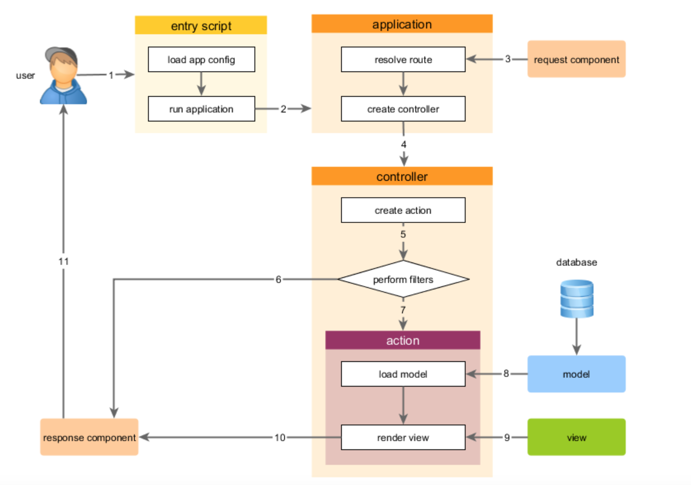

#Panoramica


Ogni volta che un'applicazione Yii gestisce una richiesta, subisce un flusso di richieste come segue:

1. Un utente fa una richiesta allo script di entrata ```web/index.php```.
2. Lo script di entrata carica la configurazione dell'applicazione e crea un'istanza dell'applicazione per gestire la richiesta.
3. L'applicazione converte il percorso richiesto con l'aiuto del componente dell'applicazione richiesta.
4. L'applicazione crea un'istanza del controller per gestire la richiesta.
5. Il controller crea un'istanza di azione ed esegue i filtri per l'azione.
6. Se un filtro fallisce, l'azione viene annullata.
7. Se tutti i filtri passano, l'azione viene eseguita.
8. L'azione carica un modello di dati , possibilmente da un database.
9. L'azione rende una vista , fornendola con il modello di dati.
10. Il risultato del rendering viene restituito al componente dell'applicazione di risposta .
11. Il componente di risposta invia il risultato visualizzato al browser dell'utente.

Il seguente diagramma mostra come un'applicazione gestisce una richiesta.



In questa sezione, descriveremo in dettaglio come funzionano alcuni di questi passaggi.

